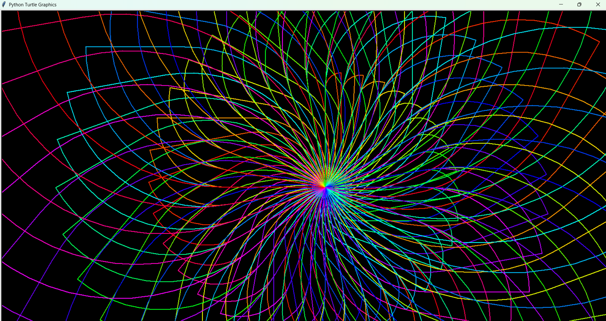

# Python-project-using-Turtle-for-Graphics
The program draws a kaleidoscope-like rainbow spiral pattern with multiple arcs and straight lines.  Since the hue changes smoothly, you’ll see a rainbow swirl effect on a black background.

Step-by-step Explanation:

1.Imports:

from turtle import *
from colorsys import *

turtle → lets us draw shapes and patterns.

colorsys → helps with converting color formats (here, HSV to RGB).

2.Setup:

setposition(50, -50)   # Starting position of the turtle
speed(0)               # Fastest drawing speed
bgcolor('black')       # Background color is black
pensize(2)             # Thickness of the pen lines
n = 100                # Used for color stepping
h = 0                  # Hue starting point

3.Main Loop

for i in range(120):       # Outer loop (rotations)
    for j in range(4):     # Inner loop (drawing shapes)
        color(hsv_to_rgb(h, 1, 1))   # Pick color using HSV
        h += 1/n                      # Increase hue (smooth rainbow effect)
        circle(40+i*5, 90)            # Draw a quarter-circle arc
        forward(250)                  # Move forward
        left(90)                      # Turn left
    rt(10)                            # Rotate slightly right

The inner loop draws 4 connected quarter-circle arcs and lines.

The outer loop rotates the whole shape slightly (rt(10)), repeating 120 times.

Hue (h) increases gradually, giving a rainbow gradient effect.

4.Finishing

hideturtle()

Hides the turtle pointer so only the artwork is visible.

